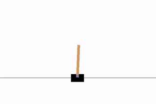
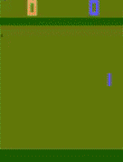

# PAAC Implementation

<table align="center">
<tr>
<td>

</td>
<td>

</td>
</tr>
<tr>
    <td>
        CartPole-v0
    </td>
    <td>
        Pong-v0 (training for a few hours)
    </td>

</tr>
</table>

- Implementation of "Efficient Parallel Methods for Deep Reinforcement Learning" AKA PAAC
- WIP

## Original paper
"Efficient Parallel Methods for Deep Reinforcement Learning"
Alfredo V. Clemente, Humberto N. Castejón, Arjun Chandra
Arxiv: https://arxiv.org/abs/1705.04862
